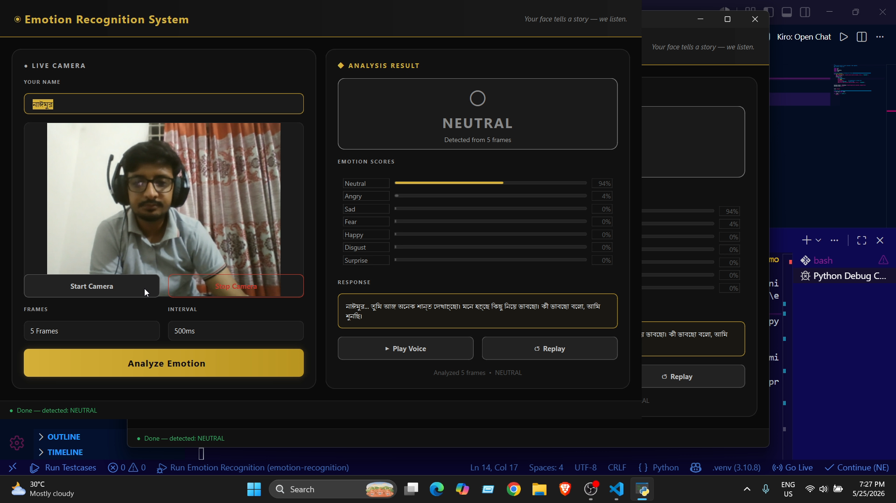
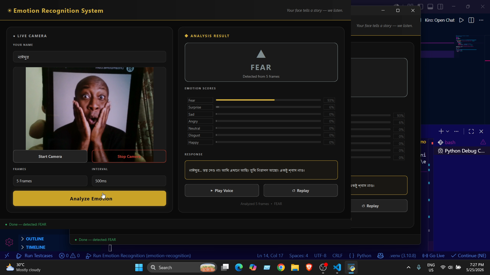
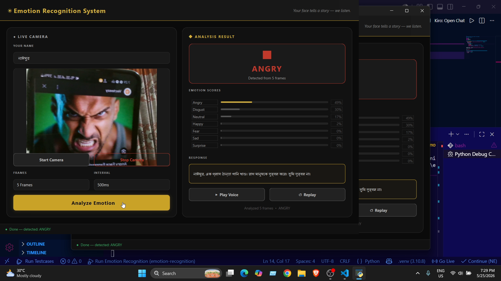
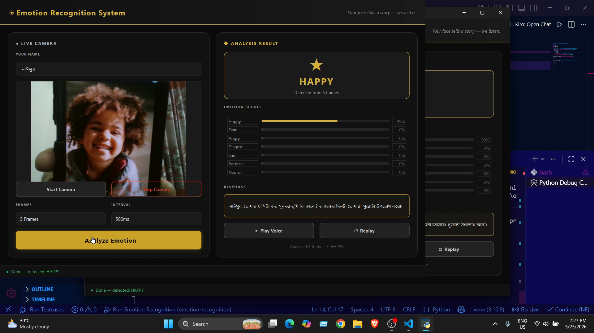

```
  ███████╗███╗   ███╗ ██████╗ ████████╗██╗ ██████╗ ███╗   ██╗
  ██╔════╝████╗ ████║██╔═══██╗╚══██╔══╝██║██╔═══██╗████╗  ██║
  █████╗  ██╔████╔██║██║   ██║   ██║   ██║██║   ██║██╔██╗ ██║
  ██╔══╝  ██║╚██╔╝██║██║   ██║   ██║   ██║██║   ██║██║╚██╗██║
  ███████╗██║ ╚═╝ ██║╚██████╔╝   ██║   ██║╚██████╔╝██║ ╚████║
  ╚══════╝╚═╝     ╚═╝ ╚═════╝    ╚═╝   ╚═╝ ╚═════╝ ╚═╝  ╚═══╝
  ██████╗ ███████╗ ██████╗ ██████╗  ██████╗ ███╗   ██╗██╗████████╗██╗ ██████╗ ███╗   ██╗
  ██╔══██╗██╔════╝██╔════╝██╔═══██╗██╔════╝ ████╗  ██║██║╚══██╔══╝██║██╔═══██╗████╗  ██║
  ██████╔╝█████╗  ██║     ██║   ██║██║  ███╗██╔██╗ ██║██║   ██║   ██║██║   ██║██╔██╗ ██║
  ██╔══██╗██╔══╝  ██║     ██║   ██║██║   ██║██║╚██╗██║██║   ██║   ██║██║   ██║██║╚██╗██║
  ██║  ██║███████╗╚██████╗╚██████╔╝╚██████╔╝██║ ╚████║██║   ██║   ██║╚██████╔╝██║ ╚████║
  ╚═╝  ╚═╝╚══════╝ ╚═════╝ ╚═════╝  ╚═════╝ ╚═╝  ╚═══╝╚═╝   ╚═╝   ╚═╝ ╚═════╝ ╚═╝  ╚═══╝
  ███████╗██╗   ██╗███████╗████████╗███████╗███╗   ███╗
  ██╔════╝╚██╗ ██╔╝██╔════╝╚══██╔══╝██╔════╝████╗ ████║
  ███████╗ ╚████╔╝ ███████╗   ██║   █████╗  ██╔████╔██║
  ╚════██║  ╚██╔╝  ╚════██║   ██║   ██╔══╝  ██║╚██╔╝██║
  ███████║   ██║   ███████║   ██║   ███████╗██║ ╚═╝ ██║
  ╚══════╝   ╚═╝   ╚══════╝   ╚═╝   ╚══════╝╚═╝     ╚═╝
```

# 😊 Emotion Recognition System with Bangla Voice Response

### *Real-Time Facial Emotion Detection — Powered by DeepFace + Microsoft Neural TTS*

> **An intelligent emotion detection system that analyzes the user's facial expressions**
> **and responds back in Bangla voice accordingly.**
> Detects real-time emotion using DeepFace, then generates a personalized Bangla response
> using Microsoft Nabanita Neural Voice — a fully offline-capable desktop application.

[](https://github.com/naimurhamim)
[](#)
[](#license)
[](#)
[](#)
[](#)

---

## 🎬 Demo Video

<div align="center">

[](https://youtu.be/VIDEO_ID_HERE)

**▶ [Watch Full Demo on YouTube](https://youtu.be/VIDEO_ID_HERE)**

</div>

---

## 📸 Demo Screenshots

| Neutral Detection | Fear Detection |
|---|---|
|  |  |

| Angry Detection | Happy Detection |
|---|---|
|  |  |

> The system detects facial expressions in real time, displays emotion scores, and responds with a Bangla voice output.

---

## 📌 Project Overview

The Emotion Recognition System is an AI-powered desktop application that analyzes a person's facial expression to understand their emotional state and responds in Bangla language accordingly.

When a person is sad, angry, or frustrated — a compassionate response can have a positive impact on their mood. This system is an attempt to bring that idea to life.

**Core Goals:**
- Detect facial expressions in real time from a webcam
- Generate personalized Bangla responses based on the detected emotion
- Deliver the response via Microsoft Nabanita Neural Voice
- Run as a complete desktop GUI application

---

## ✨ Features

| Feature | Description |
|---|---|
| 😊 **Real-Time Emotion Detection** | Captures multiple frames from webcam and analyzes emotion |
| 🎯 **8 Emotion Support** | Happy, Sad, Depressed, Angry, Surprised, Fear, Disgust, Neutral |
| 🗣️ **Bangla Neural Voice** | Natural Bangla speech using Microsoft bn-BD-NabanitaNeural |
| 📊 **Emotion Score Bars** | Visual confidence score bars for each detected emotion |
| 👤 **Personalized Response** | Responses personalized with the user's name |
| 🖥️ **Desktop GUI** | Gold/Silver/Black themed desktop app built with PyQt6 |
| ⚡ **Multi-Frame Analysis** | Determines dominant emotion across multiple frames for better accuracy |
| 🔄 **Replay Voice** | Replay the voice response at any time |
| 🚀 **Single Command Launch** | Backend and GUI both start together with a single command |

---

## 🛠️ Tech Stack

| Component | Technology |
|---|---|
| Emotion Detection | DeepFace (FER model) |
| Backend API | FastAPI + Uvicorn |
| Desktop GUI | PyQt6 |
| Voice Synthesis | Microsoft Edge TTS (bn-BD-NabanitaNeural) |
| Camera Processing | OpenCV 4.x |
| ML Framework | TensorFlow / Keras |
| Language | Python 3.10 |
| Communication | REST API (localhost) |

---

## 🧠 How It Works

```
Webcam → Frame Capture (3–10 frames)
        ↓
DeepFace Emotion Analysis → Detect emotion in each frame
        ↓
Dominant Emotion Selection → Most common emotion across all frames
        ↓
Response Generation → Generate Bangla text using Emotion + User Name
        ↓
Edge TTS (Nabanita Neural) → Convert Bangla text to voice
        ↓
GUI Result Display → Emotion, Score Bars, Response Text, Audio Player
```

---

## 📊 Emotion → Response Mapping

| Emotion | Response Type |
|---|---|
| 😊 Happy | Encouraging words, amplifying the joy |
| 😢 Sad | Empathy + light humor to lift the mood |
| 😔 Depressed | Motivational and uplifting words |
| 😠 Angry | Calming and soothing response |
| 😲 Surprised | Curious and playful reaction |
| 😨 Fear | Reassuring and comforting words |
| 🤢 Disgust | Positive reframing and optimism |
| 😐 Neutral | Friendly conversational response |

---

## 📁 Project Structure

```
emotion-recognition/
│
├── run_gui.py              # Single entry point — starts backend + GUI together
├── run.py                  # Run backend only
├── README.md
│
├── 📁 backend/
│   ├── main.py             # FastAPI server — REST API endpoints
│   ├── emotion_engine.py   # Emotion detection logic using DeepFace
│   ├── voice_engine.py     # Edge TTS — Nabanita Neural voice generation
│   ├── response_map.py     # Emotion → Bangla response mapping
│   ├── requirements.txt    # Python dependencies
│   └── 📁 audio/           # Generated voice files (auto-created)
│
├── 📁 gui/
│   └── app.py              # PyQt6 desktop GUI — complete UI
│
├── 📁 dataset/
│   ├── 📁 train/           # Training images (angry/happy/sad/...)
│   └── 📁 test/            # Test images
│
├── 📁 Screenshots/         # Demo screenshots
│
└── 📁 .venv/               # Python 3.10 virtual environment
```

---

## 🚀 Getting Started

### Prerequisites

- Python **3.10**
- Webcam
- Internet connection (required for Edge TTS)

### 1. Clone the Repository

```bash
git clone https://github.com/naimurhamim/emotion-recognition-system.git
cd emotion-recognition-system
```

### 2. Create Virtual Environment

```bash
py -3.10 -m venv .venv

# Windows
.venv\Scripts\activate
```

### 3. Install Dependencies

```bash
pip install -r backend/requirements.txt
```

### 4. Run the App

```bash
python run_gui.py
```

> On first run, DeepFace will automatically download its model (~100MB) — this only happens once.

---

## ⚙️ API Endpoints

The backend FastAPI server runs at `http://127.0.0.1:8000`.

| Method | Endpoint | Description |
|---|---|---|
| GET | `/` | API status check |
| GET | `/health` | Health check |
| POST | `/analyze` | Analyzes frames and returns emotion + voice response |
| GET | `/emotions` | Returns list of supported emotions |

### `/analyze` Request Body

```json
{
  "frames": ["base64_image_1", "base64_image_2"],
  "user_name": "Naimur"
}
```

### `/analyze` Response

```json
{
  "dominant_emotion": "happy",
  "avg_scores": { "happy": 92.5, "neutral": 5.2, "sad": 2.3 },
  "frame_count": 5,
  "response_text": "Naimur, do you know how beautiful your smile is?",
  "audio_url": "/static/audio/abc123.mp3"
}
```

---

## 🔬 Methodology

### Emotion Detection Pipeline

The system uses the DeepFace library with a pre-trained FER (Facial Expression Recognition) model to detect emotions. For each frame, probability scores are generated for 7 base emotions, and the dominant emotion is determined by majority vote across all captured frames.

### Multi-Frame Strategy

A single frame can produce incorrect detections due to noise or partial occlusion. To address this, 3–10 frames are captured and the most frequently occurring dominant emotion across all frames is selected as the final result.

### Voice Response System

Microsoft Edge TTS with the `bn-BD-NabanitaNeural` voice is used — Microsoft's neural voice for Bangladeshi Bangla that is free and sounds natural. All response texts are written in pure Bangla Unicode so the TTS engine pronounces them correctly.

---

## 📈 Future Plans

- [ ] **Custom Dataset Training** — Fine-tune the model with a custom dataset
- [ ] **Offline Voice** — Integrate a local TTS model that works without internet
- [ ] **Emotion History** — Track emotion timeline throughout a session
- [ ] **Multi-Face Detection** — Detect emotions from multiple faces simultaneously
- [ ] **Mobile App** — Build an Android/iOS version
- [ ] **Mental Health Integration** — Analyze long-term emotion patterns
- [ ] **Custom Voice Training** — Train a custom Bangla voice model
- [ ] **Emotion-Based Music** — Play background music based on detected emotion
- [ ] **Report Generation** — Generate daily/weekly emotion summary reports

---

## 📦 requirements.txt

```txt
fastapi==0.111.0
uvicorn==0.29.0
python-multipart==0.0.9
opencv-python==4.9.0.80
deepface==0.0.93
tf-keras==2.16.0
numpy==1.26.4
Pillow==10.3.0
edge-tts==7.2.8
PyQt6==6.7.0
```

---

## 🤝 Contributing

1. Fork the repo
2. Create your feature branch: `git checkout -b feature/NewFeature`
3. Commit: `git commit -m 'Add NewFeature'`
4. Push: `git push origin feature/NewFeature`
5. Open a Pull Request

---

## 📄 License

Licensed under the **MIT License** — see [LICENSE](LICENSE) for details.

---

## 👨‍💻 Author

**MD Naimur Hamim**

Department of IoT and Robotics Engineering
University of Frontier Technology, Gazipur-1750, Bangladesh

[](https://github.com/naimurhamim)

---

*Built with ❤️ for Mental Health Awareness & Human-Computer Interaction Research*

⭐ **If you found this project helpful, please give it a star!** ⭐
